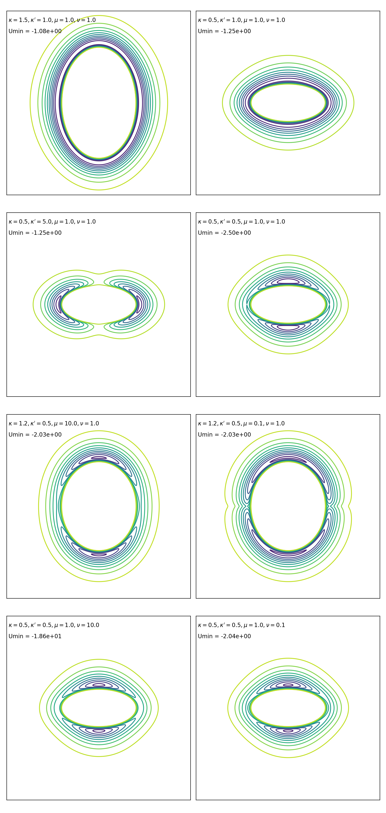

## Python implementation of the anisotropic Gay-Berne potential

### References:
* Gay, J. G.; Berne, B. *J. J. Chem. Phys.* **1981**, *74*, 3316–3319
* Bates, M. A.; Luckhurst, G. R. *J. Chem. Phys.* **1996**, *104*, 6696–6709
